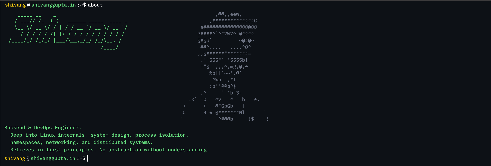

# Terminal Portfolio

A terminal-themed developer portfolio built with [Next.js](https://nextjs.org) and Tailwind CSS. 

## Getting Started

First, install the dependencies and run the development server:

```bash
npm install
npm run dev
```

Open [http://localhost:3000](http://localhost:3000) with your browser to see the outcome. You can start editing the page by modifying `app/page.tsx` or `src/app/page.tsx`. The page auto-updates as you edit the file.

## Deployment Configurations

This project is configured for static export (`output: "export"`) and includes GitHub Actions workflows to deploy seamlessly to multiple environments.

The deployment target relies on a `DEPLOY_TARGET` environment variable set in the workflows. This variable safely controls the `basePath` mapping in `next.config.ts` without conflicting with Node environments.

### 1. GitHub Pages
* **Workflow:** `.github/workflows/deploy-github-pages.yml`
* **Behavior:** Sets `DEPLOY_TARGET: gh-pages`. Since GitHub Pages handles projects at a subdirectory (`username.github.io/repo-name`), Next.js automatically derives the repository name and assigns it to the `basePath` to ensure asset URLs properly resolve.

### 2. Cloudflare Pages
* **Workflow:** `.github/workflows/deploy-cloudflare-pages.yml`
* **Behavior:** Sets `DEPLOY_TARGET: cloudflare-pages`. Cloudflare Pages hosts the project at the root domain by default, so no Next.js `basePath` is required.
